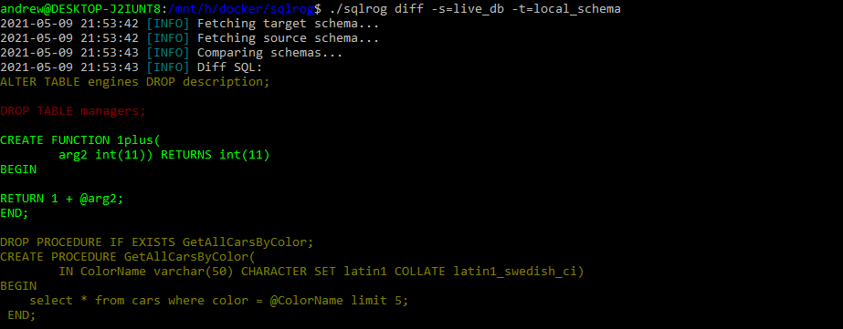

**SqlRog** is a tool for managing schema changes in SQL relational databases. Using SqlRog you can:

* Create local SQL project and export your database (tables, procedures, functions, etc) in Yaml files in order to track changes in version control systems
* Compare the changes in local project against Database and generate SQL statements for update
* Compare the changes from one Database to another and generate SQL statements for update
* Create multiple local projects

SqlRog currently supports: 
* MySQL 5.6
* Firebird 2.6

To support other databases you can create your own adapter.

## Usage
Build the package
```bash
$ go build -o sqlrog github.com/stpatrickw/sqlrog/cmd
```
Run the help command to get all available commands
```bash
$ ./sqlrog --help
```


### `add` command

The `add` command generates new project

```bash
$ ./sqlrog add [options]
```

You must provide required arguments: name, type, engine and corresponding parameters for specific engine.
Available flags are:

```
-config=filename, -c        Config file name. 'config.yml' is deafult value.

-type=name, -t              Project type. There are two types available: 
                            - file (Used for storing local schema in files)
                            - connection (Live connection to Database)

-engine=name, -e            Engine represents an adapter name which should be used to
                            operate a database. This parameter is required only in case
                            connection type is chosen. (For instance 'mysql5.6', 'firebird2.5')

-name=name, -n              Project name. 

-readertype=name, -r        Schema reader type. Yaml files by deafault.

-source=name, -s            Source project with connection type for newly created file project 

-help, -h                   Show the list of available commands 
```

Each engine has it's own parameters that should be provided when add command is called.
For example for `mysql5.6` engine command arguments could be look like:
```bash
$ ./sqlrog add -t=connection -n=example -e=mysql5.6 host=localhost port=3306 user=USER password=PASSWORD database=example
```
File project arguments:
```bash
$ ./sqlrog add -t=file -n=local_schema -s=example
```

### `show` command

The `show` command print all projects with their configs:
```bash
$ ./sqlrog show
```

### `diff` command

Diff command represent powerful tool that can compare two different projects. Available flags are:

```
-config=c, -c               Config file name. 'config.yml' is deafult value.

-source=name, -s            Source project that is going to be used for comparing. Could have type 
                            file/connection

-target=name, -t            Target project that is going to be used for comparing. Could have type 
                            file/connection

-apply, -a                  Flag indicates wether changes should be applied to source project or 
                            just printed out.  

-filter=text, -r            Filter string for changes that match the name in every element schema (table, 
                            procedure, view, etc.) 

-help, -h                   Show the list of available commands 
```

## Screenshots



## Use Cases

1. There is a need to track database schema under version control system. Two projects should be created: first for 
local schema in files and second for live database to compare the changes. 
    ```bash
    $ ./sqlrog add -t=connection -n=live_db -e=mysql5.6 host=LIVE_HOST port=3306 user=USER password=PASSWORD database=live_db
    $ ./sqlrog add -t=file -n=local_schema -s=live_db
    ```
   Every time when new changes in live db schema happen do a comparison in schemas and add to git:
    ```bash
    $ ./sqlrog diff -s=live_db -t=local_schema -a
    $ git add .
    $ git commit -m "some changes occur"
    ```

2. The changes that is in live needed to be reverted down to the specific branch:
    ```bash
    $ git checkout <previous_release> 
      
    ... generate sql script and run it anywhere on db environment
    $ ./sqlrog diff -s=local_schema -t=live_db > script.sql
   
    ... or apply changes directly to live_db 
    $ ./sqlrog diff -s=local_schema -t=live_db -a
    ```
  
3. There is also a lower stage environment that periodically should be mirrored from live database:
    ```bash
    $ ./sqlrog add -t=connection -n=stage_db -e=mysql5.6 host=STAGE_HOST port=3306 user=USER password=PASSWORD database=stage_db
    
    ... run diff command to get stage database mirrored
    $ ./sqlrog diff -s=live_db -t=stage_db > script.sql 
    
   ... or update changes directly
    $ ./sqlrog diff -s=live_db -t=stage_db -a
    ```
4. Having a database schema under the git, we know for sure what state it should have on a specific branch.
   That means that **SqlRog** can be integrated in Jenkins pipelines to generate new databases that are needed during 
   the tests run. 

The above examples describe the workflow which is quite similar to migration approach, but has an advantage that no 
matter what git strategy we are following and git branch is currently selected we won't fall into the trap of uncertainty 
what migration version should be reverted and what versions should be applied from one branch to another.


## Author

[Andrey Demidenko](https://github.com/stpatrickw)